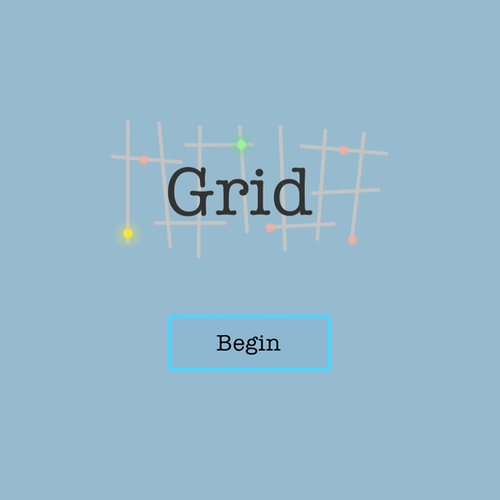

Grid
===
Fight enemies on a square grid for an unspecified reason.

Controls
===
WASD of Arrow keys to move
Click to shoot

Screenshot
===

Resources
===
Music for Opening, levels, and ending
http://opengameart.org/content/generic-8-bit-jrpg-soundtrack

Various Sound Effects
https://www.leshylabs.com/apps/sfMaker/
